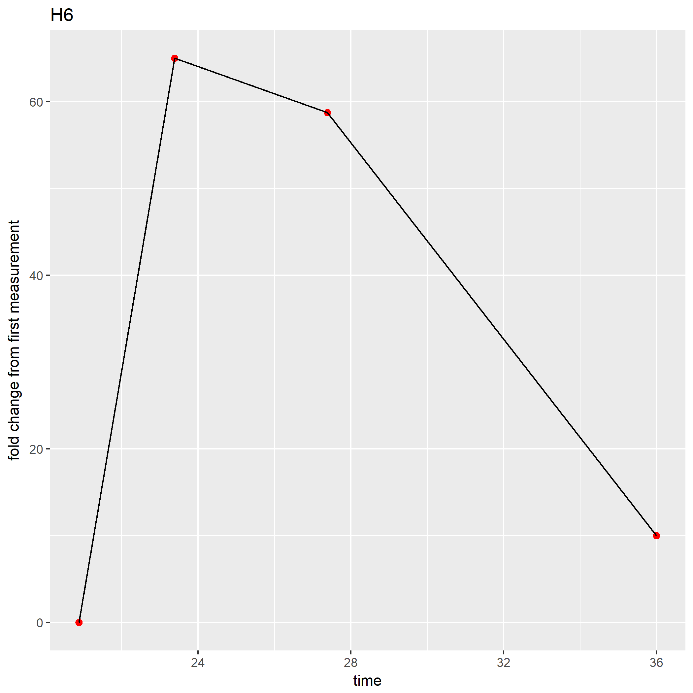
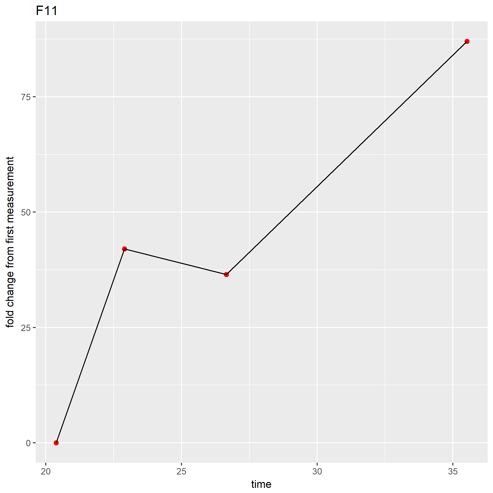

```{r setup, include=FALSE}
knitr::opts_chunk$set(echo = TRUE)
```

import CSV file, need to first order excel file so well name is in column 1 and are ordered by that column. also in excel calculate "run time" column

comments are work in progress to do this for us
```{r,echo=FALSE}
x <- read.csv("pulsed_table.csv")

snames <- as.matrix(c(paste0("A",1:12),
          paste0("B",1:12),
          paste0("C",1:12),
          paste0("D",1:12),
          paste0("E",1:12),
          paste0("F",1:12),
          paste0("G",1:12),
          paste0("H",1:12)))

# #for (i in 1:3){
#snames <- cbind(snames,snames)}
          

```

for loop, also work in progress
```{r,echo=FALSE}
# for (name in x[,1]){
#   for (identifier in snames[,1]){
#     if (name == identifier){
#       snames[,identifier] <- x[,3:4]
#     }
#     next
#   }
#  next
# }
```

change number in code below to how many time points you have taken ie. 6 reads on each well

```{r, echo = TRUE, message=TRUE, eval= TRUE}
library(ggplot2)

n <- 4

for (i in 1:96){

time <- as.numeric(as.character(x[((i*n)-(n-1)):(n*i),"Run.Time" ]))

z <-as.numeric(x[((i*n)-(n-1)):(n*i),"M2...All"])

fold_decrease <- (z[1:n]-z[1])/z[1]
df <- cbind.data.frame(time,fold_decrease)
ggplot(df, aes_string(x= "time", y= "fold_decrease"))+ geom_line()+ ggtitle(x[n*i,1])+ ylab("fold change from first measurement")+geom_point(size=2, col= "red")+geom_line()
ggsave(paste0(x[n*i,1],".png"))      
}
```
graphs of experimental conditions A1,A2, and various controls. percent change is calculated by 
((non-binders at time x) - (non-binders at time=1))/(non-binders at time 1) 

Therefore positive change reflects more binding, negative change reflects less binding or "falling off". 


<!-- Experimental monoclonals -->
<!--  -->

<!--  -->

<!-- Diatom enriched library H6 -->
<!--  -->
<!--  -->
<!-- interestingly in the diatom only control, the diatoms themself became more flourescent in the FITC range over the time course  -->

<!-- Niave Library G4 -->
<!--  -->

<!-- Negative control lib F11 -->
<!--  -->
<!-- almost no difference in negative control lib over experiment, these bacteria consistantly showed 20-50% "non binders" whereas experimental conditions usually showed <5%. I believe this is due to this strain being poorly flourescent.  -->