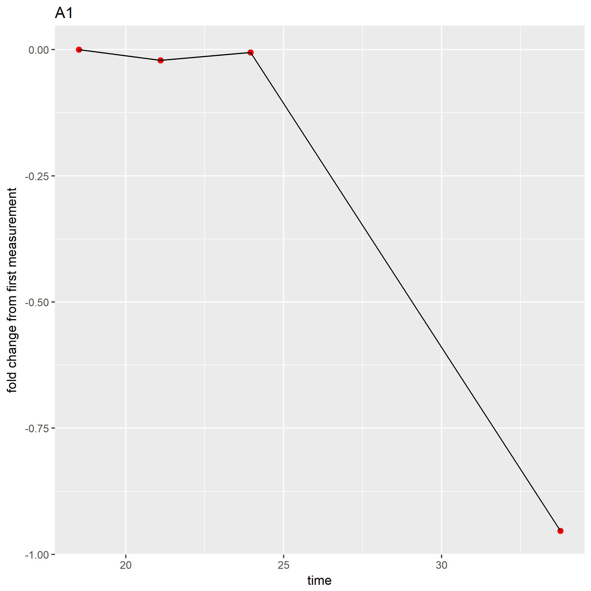
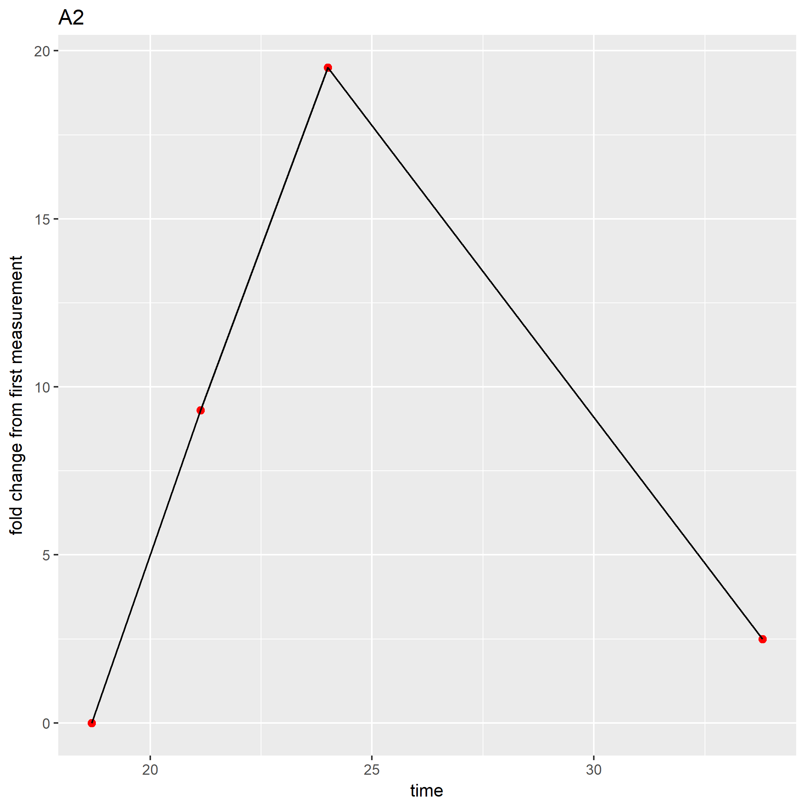
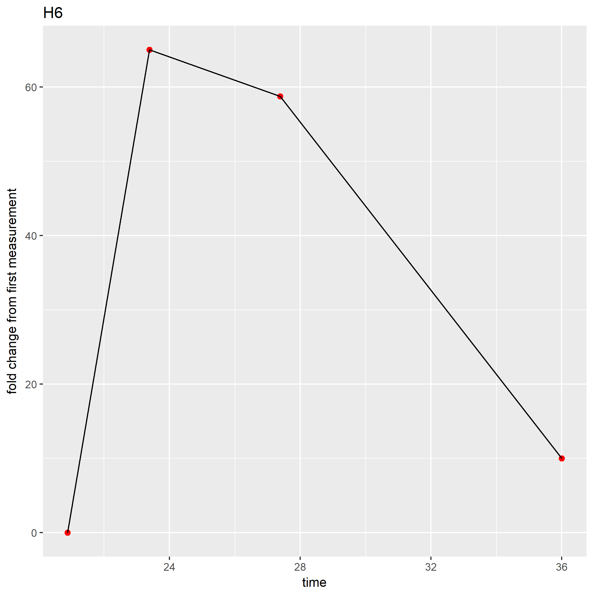
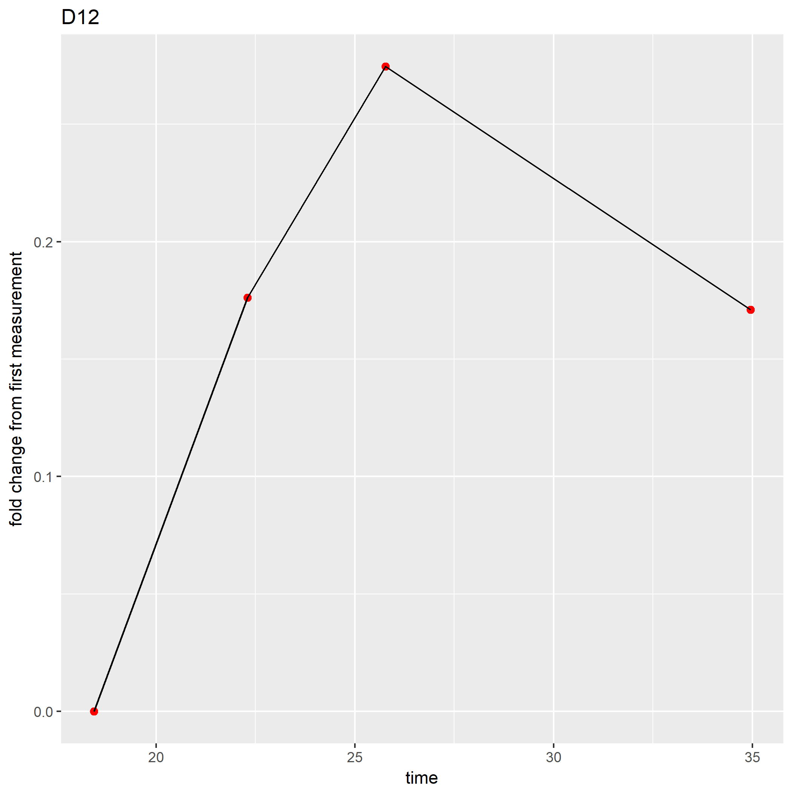
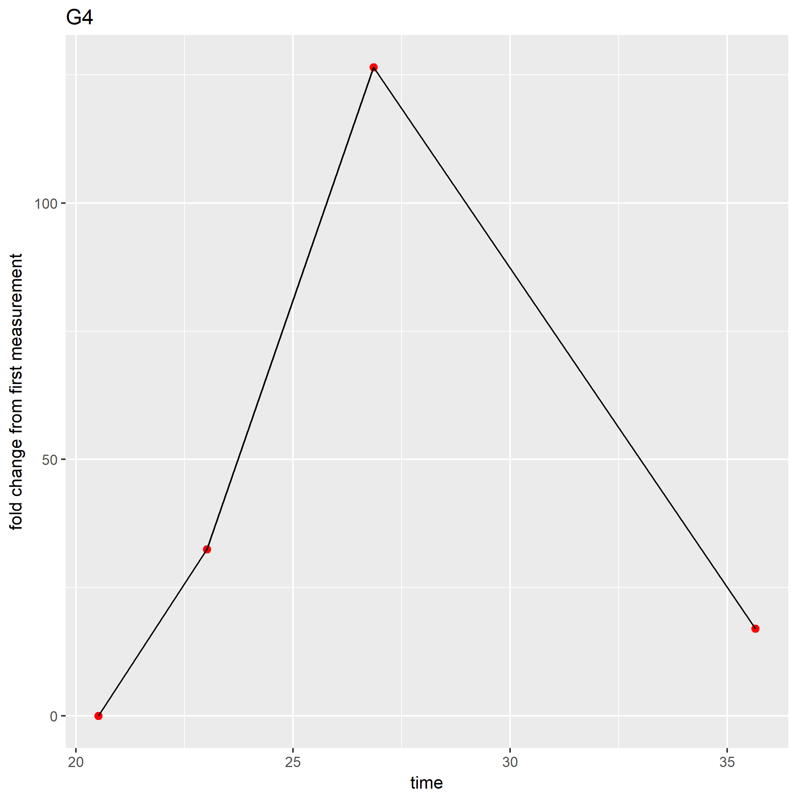
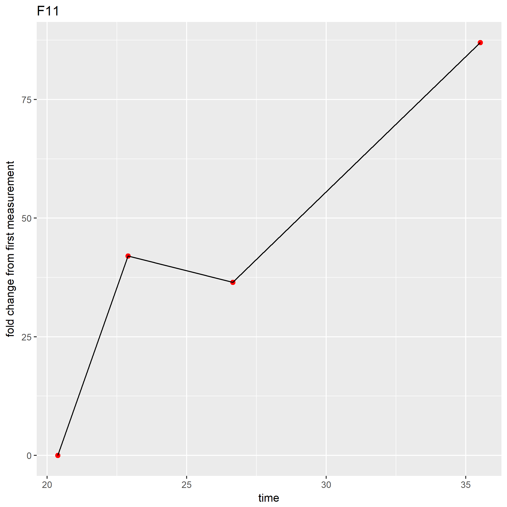

diatom TCS
================

import CSV file, need to first order excel file so well name is in column 1 and are ordered by that column. also in excel calculate "run time" column

comments are work in progress to do this for us

for loop, also work in progress

change number in code below to how many time points you have taken ie. 6 reads on each well

``` r
library(ggplot2)


for (i in 1:96){
x=4
time <- x[((i*x)-5):(x*i),"Run.Time" ]
z <-as.numeric(x[((i*x)-5):(x*i),"E2...All"])

fold_decrease <- (z[1:x]-z[1])/z[1]
df <- cbind.data.frame(time,fold_decrease)
ggplot(df, aes_string(x= "time", y= "fold_decrease")) + geom_line(size = 1)+ ggtitle(paste(x[x*i,1], "fold change in non-binders")+ ylab("fold change from first measurement")+geom_point(size=2, col= "red")
ggsave(paste0(x[x*i,1],".png"))      

}
```

graphs of experimental conditions A1,A2, and various controls. percent change is calculated by ((non-binders at time x) - (non-binders at time=1))/(non-binders at time 1)

Therefore positive change reflects more binding, negative change reflects less binding or "falling off".

Experimental monoclonals 



Diatom enriched library H6   interestingly in the diatom only control, the diatoms themself became more flourescent in the FITC range over the time course

Niave Library G4 

Negative control lib F11  almost no difference in negative control lib over experiment, these bacteria consistantly showed 20-50% "non binders" whereas experimental conditions usually showed &lt;5%. I believe this is due to this strain being poorly flourescent.
